# 🛒 E-commerce App


---

## 🚀 Overview

**E-commerce** is a modern **Flutter app powered by Firebase** that provides a seamless shopping experience with real-time cart management, secure authentication, order tracking, and profile customization.  
It’s built to showcase clean architecture, Bloc state management, and a professional app structure.

---

## ✨ Features

- 🔑 **Authentication**
  - Email & Password registration
  - Google Sign-in
  - (Facebook Sign-in planned, issues with FB security configs)

- 🛍 **Shopping Experience**
  - Product browsing by categories
  - Product details with rich UI
  - Add to **Favorites**
  - Add to **Cart**
  - **Checkout** with saved addresses & payment methods

- 👤 **User Profile**
  - Update profile picture & username
  - Persistent cart & favorites with Firebase
  - Manage multiple addresses & payment methods

- 📦 **Orders & Notifications**
  - Order history in **My Orders**
  - Notifications page: “You’ve ordered this”

- 🔍 **Search** *(in progress)*

---

## 📱 Screens

- 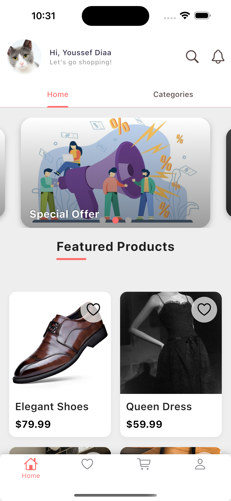  
- 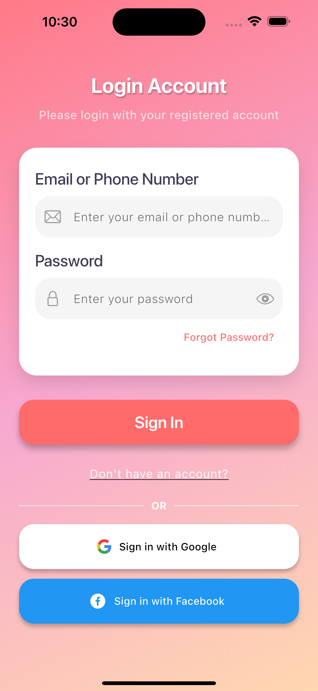 / 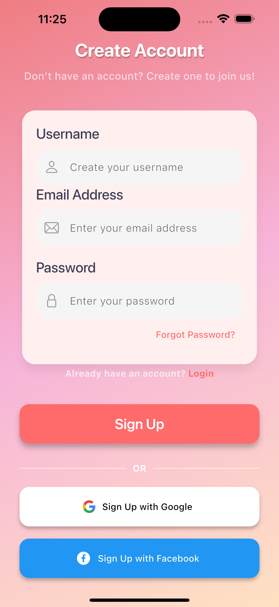  
- 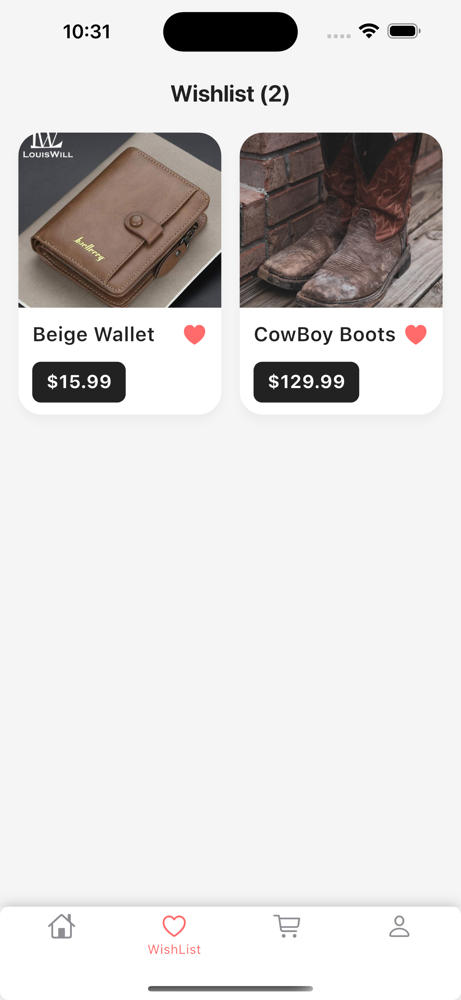  
- 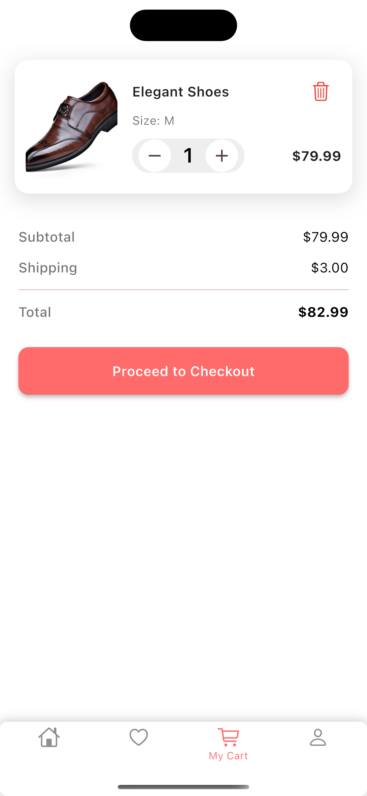  
- 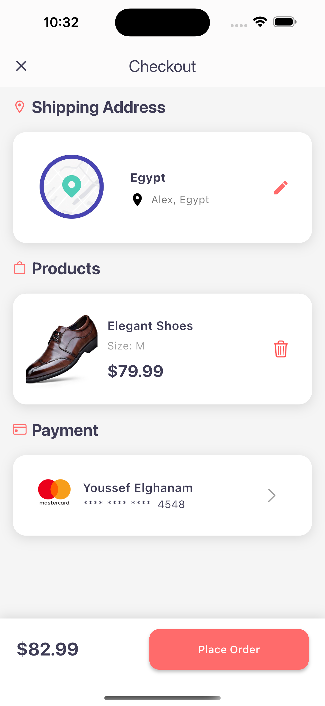  
- 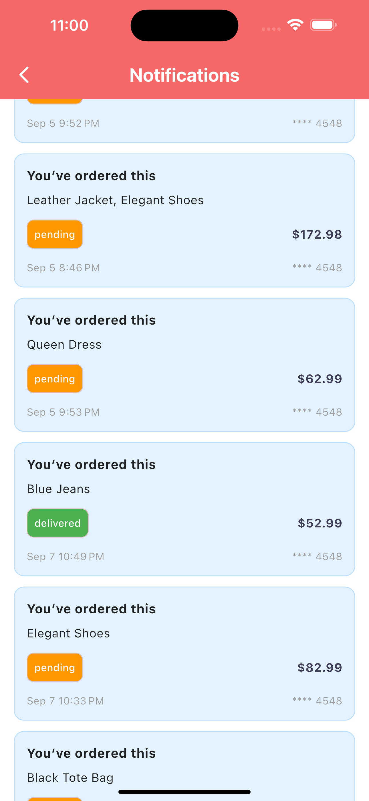  
- 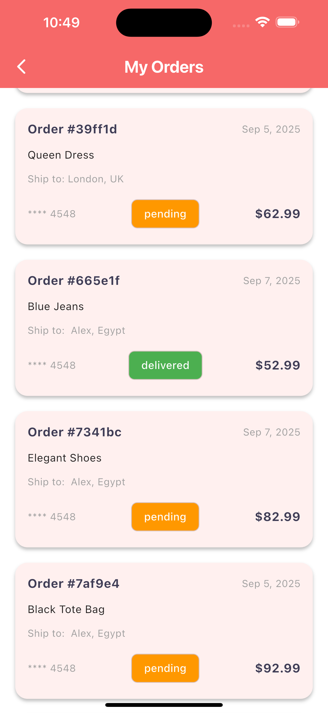  
- 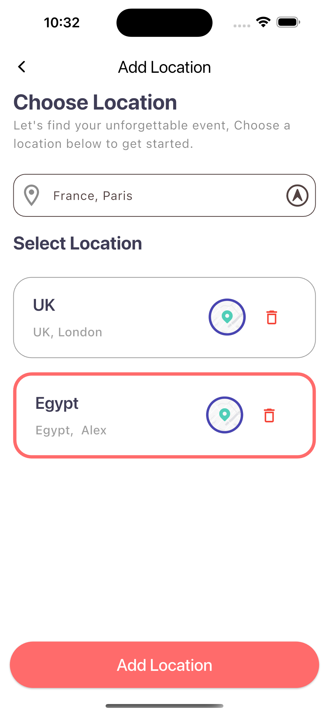  
- 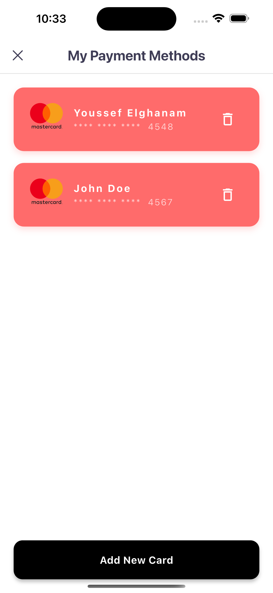  
- 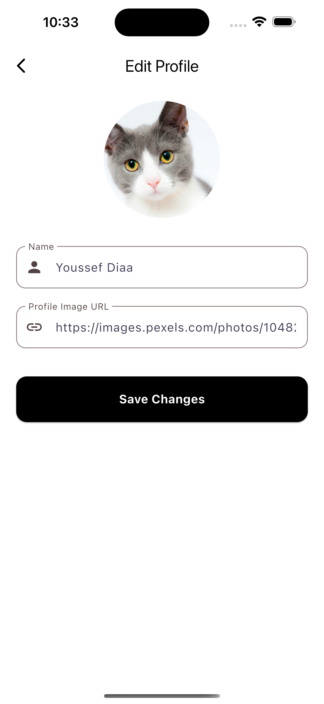  
- 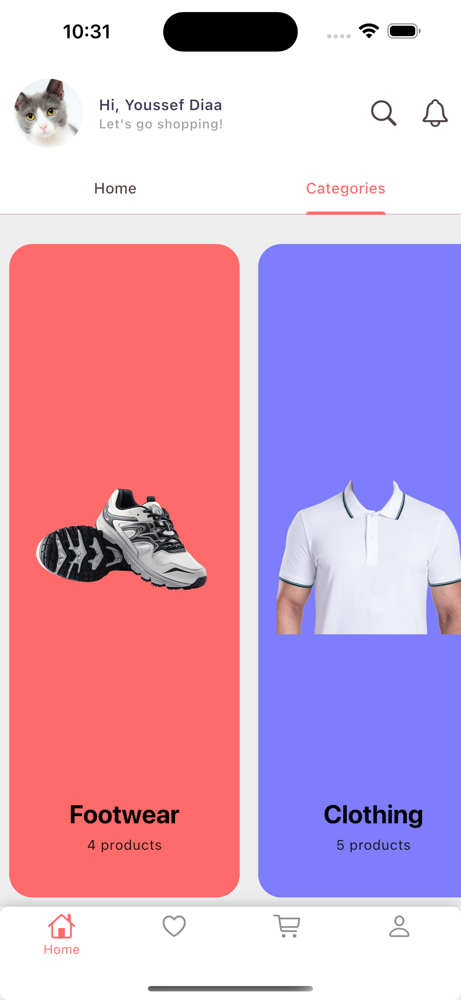  
- 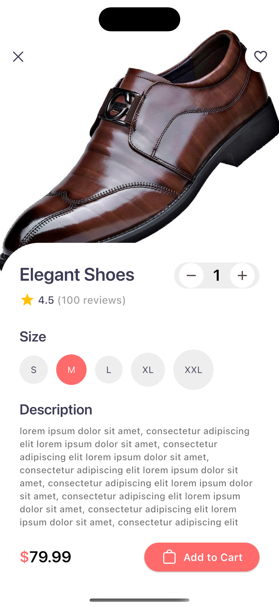  
- 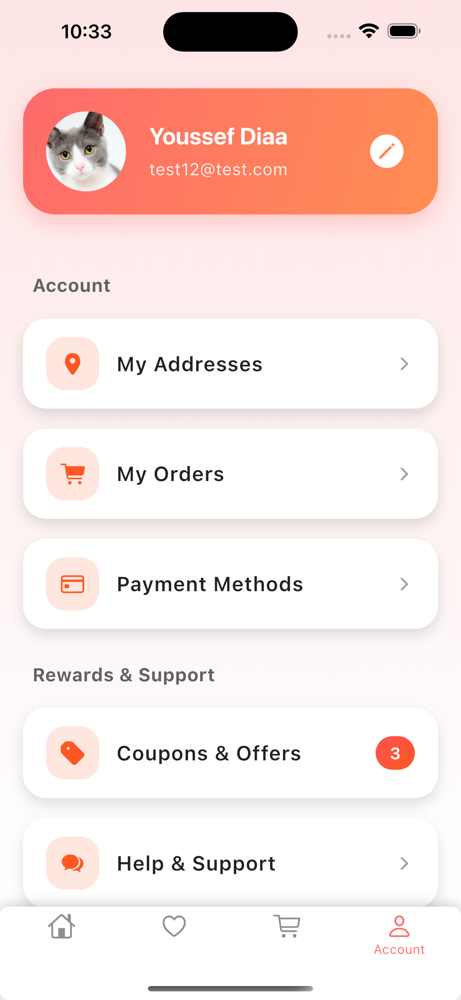  
- 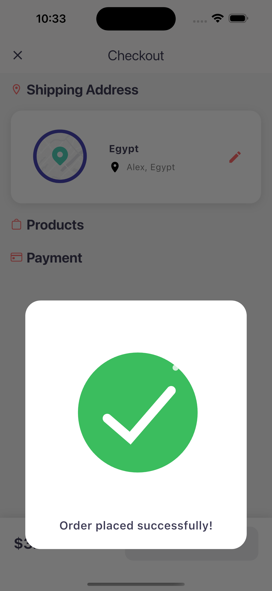  
- 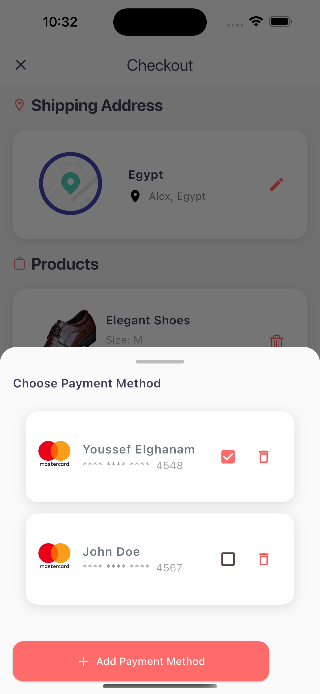  

---

## 🏗 Folder Structure

```
lib/
│
├── models/             # Data models (Product, User, Order, etc.)
├── services/           # Firebase services & APIs
├── utils/              # Routing, constants, helpers
├── view_models/        # Cubits & state management (Bloc)
├── Views/              # UI screens & widgets
└── main.dart           # App entry point
```
## ⚙️ Installation & Setup

### Prerequisites
- Flutter SDK (>=3.8.0)
- Firebase project with **Authentication** & **Firestore** enabled
- `.env` file configured with your Firebase keys

### Steps
# Clone repo
git clone [https://github.com/EngYoussefElghanam/E-commerce-App.git]
cd ecommerce-app

# Install dependencies
flutter pub get

# Run the app
flutter run
# 🛠 Tech Stack
Frontend: Flutter 3.8, Material 3

Backend: Firebase (Auth, Firestore, Storage)

State Management: Bloc & Cubit

Other Tools: Google Sign-in, Facebook Auth, Lottie animations, Persistent Bottom Nav Bar

# 📌 Roadmap
 Implement search functionality

 Fix Facebook authentication flow

 Improve product filtering

 Integrate real payment gateway (Stripe/PayPal)

 Add wishlist sharing

# 🤝 Contributing
Contributions are welcome!

Fork the project

Create a feature branch

git checkout -b feature/my-feature
Commit changes

git commit -m "Add new feature"
Push to branch

git push origin feature/my-feature
Create a Pull Request

# 📄 License
This project is licensed under the MIT License.
See the LICENSE file for details.
